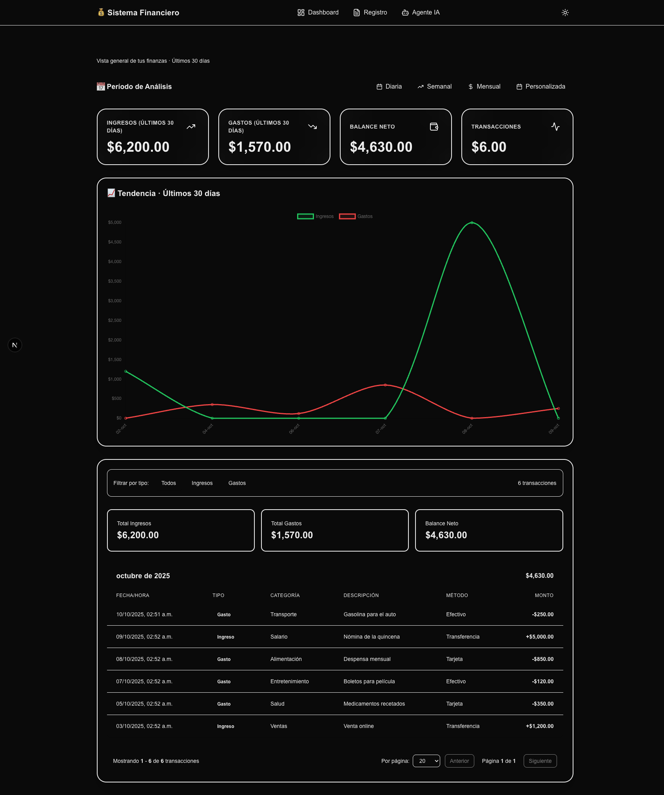

💰 Sistema de Gestão Financeira Inteligente (Finanças IA)

Um sistema completo para controle financeiro pessoal e empresarial, integrado com Inteligência Artificial para registro automático de despesas via chat, voz e fotos (OCR).



## 🚀 Funcionalidades

- **🤖 Agente IA Avançado:** Converse naturalmente ("Gastei 50 no almoço") para registrar transações.
- **📸 OCR de Comprovantes:** Envie fotos de notas fiscais; a IA lê o valor, data e categoria automaticamente.
- **📊 Dashboard em Tempo Real:** Gráficos de tendência, KPIs e tabelas detalhadas.
- **📅 Controle de Assinaturas:** Gestão de gastos recorrentes (Netflix, Aluguel) com lançamento automático.
- **✂️ Fechamento de Caixa:** Ferramenta para conferência diária de valores físicos vs sistema.
- **📂 Importação em Lote:** Suporte para arquivos Excel/CSV.
- **📱 Responsivo:** Funciona perfeitamente em computadores, tablets e celulares.

## 🛠️ Tecnologias

- **Frontend:** Next.js 15 (App Router), React 19, Tailwind CSS v4.
- **Backend:** Next.js API Routes, Server Actions.
- **Banco de Dados:** Supabase (PostgreSQL).
- **Inteligência Artificial:** Google Gemini 2.0 (via OpenRouter).
- **Gráficos:** Chart.js e Recharts.

## ⚙️ Configuração do Banco de Dados (Supabase)

Vá no **SQL Editor** do seu projeto Supabase e rode os comandos abaixo para criar as tabelas corretas em Português:

```sql
-- 1. Tabela de Transações (Receitas e Despesas)
CREATE TABLE IF NOT EXISTS transacoes (
  id UUID PRIMARY KEY DEFAULT uuid_generate_v4(),
  data TIMESTAMP WITH TIME ZONE DEFAULT NOW(),
  tipo TEXT CHECK (tipo IN ('receita', 'despesa')) NOT NULL,
  valor NUMERIC(10, 2) NOT NULL CHECK (valor > 0),
  categoria TEXT NOT NULL,
  descricao TEXT,
  metodo_pagamento TEXT DEFAULT 'Pix',
  foto_url TEXT,
  usuario_id UUID REFERENCES auth.users(id),
  created_at TIMESTAMP WITH TIME ZONE DEFAULT NOW()
);

-- 2. Tabela de Gastos Recorrentes (Assinaturas)
CREATE TABLE IF NOT EXISTS gastos_mensais (
  id UUID PRIMARY KEY DEFAULT uuid_generate_v4(),
  nome TEXT NOT NULL,
  dia_cobranca INTEGER NOT NULL CHECK (dia_cobranca BETWEEN 1 AND 31),
  valor NUMERIC(10, 2) NOT NULL CHECK (valor > 0),
  activo BOOLEAN DEFAULT true,
  usuario_id UUID REFERENCES auth.users(id),
  created_at TIMESTAMP WITH TIME ZONE DEFAULT NOW(),
  updated_at TIMESTAMP WITH TIME ZONE DEFAULT NOW()
);

-- 3. Habilitar Segurança (RLS)
ALTER TABLE transacoes ENABLE ROW LEVEL SECURITY;
ALTER TABLE gastos_mensais ENABLE ROW LEVEL SECURITY;

-- 4. Criar Políticas de Acesso (Cada usuário vê apenas seus dados)
CREATE POLICY "Acesso total transacoes" ON transacoes
  FOR ALL USING (auth.uid() = usuario_id);

CREATE POLICY "Acesso total gastos mensais" ON gastos_mensais
  FOR ALL USING (auth.uid() = usuario_id);

-- 5. Bucket para Fotos (Storage)
-- Crie um bucket público chamado 'comprovantes' no menu Storage do Supabase.

🚀 Como Rodar o Projeto

    Clone o repositório:
    Bash

git clone [https://github.com/seu-usuario/financas-ia.git](https://github.com/seu-usuario/financas-ia.git)
cd financas-ia

Instale as dependências:
Bash

npm install

Configure as Variáveis de Ambiente: Renomeie o arquivo .env.example para .env.local e preencha:
Snippet de código

# Supabase (Configurações do Projeto)
NEXT_PUBLIC_SUPABASE_URL=sua_url_do_supabase
NEXT_PUBLIC_SUPABASE_ANON_KEY=sua_chave_anonima

# IA (Obtenha em openrouter.ai)
OPENROUTER_API_KEY=sua_chave_openrouter

# URL do Site (para redirecionamentos)
NEXT_PUBLIC_SITE_URL=http://localhost:3000

Inicie o servidor de desenvolvimento:
Bash

    npm run dev

    Acesse http://localhost:3000 no navegador.

📂 Estrutura do Projeto

    /app: Páginas e Rotas da aplicação.

        /agente-avancado: Chat com IA e upload de fotos.

        /corte-diario: Fechamento de caixa.

        /gastos-recorrentes: Gestão de assinaturas.

        /api: Backend (Webhooks, Integrações).

    /components: Componentes visuais (Gráficos, Cards, Header).

    /lib: Configurações de serviços (Supabase, Utils).

    /hooks: Lógica reutilizável (Upload, Chat).

📄 Licença

Este projeto é de uso pessoal e educacional. Sinta-se livre para modificar e melhorar.

